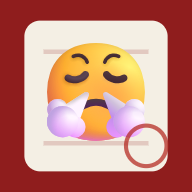

<div align="center">
  
  <h1>小氣簿</h1>
  <p><strong>我沒有記仇，我只是有完整紀錄。</strong></p>
  <p>一個帶黑色幽默與儀式感的「人際犯錯紀錄系統」。<br>把朋友、家人、另一半和同事令人激氣的日常小事，正式記入案卷。</p>
</div>

## 專案介紹

「小氣簿」是一個以 iPhone 使用體驗優先設計的純前端網頁應用程式。

它把日常人際摩擦包裝成一套「政府文件 × 學校訓導處 × 復古記事簿」風格的犯錯管理系統。每宗事件都有案件編號、犯錯級別、點數、改善期限和案件狀態，亦可以生成正式的犯錯通知及改善回條。

所有個人資料只會保存在使用者自己的瀏覽器，不需要帳號、伺服器或資料庫。

## 主要功能

- **今日小氣 Dashboard**：總犯錯點數、本月案件、最高危人物、最近案件及排行榜。
- **人物簿**：管理姓名、暱稱、關係、Emoji／圖片頭像、危險指數及關係信用分。
- **案件簿**：記錄事件、日期、地點、心情、改善建議、期限、狀態、備註及證據圖片。
- **固定犯錯分數**：按犯錯類型自動計算，避免手動輸入錯誤。
- **賞罰紀錄**：支援道歉、補救、請食飯、送禮、改善及特別赦免等加減分原因。
- **判案室**：根據事件關鍵字、內容長度和過往紀錄自動建議判決。
- **四種判官模式**：公正、小氣、超級記仇及寬宏大量。
- **犯錯通知及改善回條**：正式文件版面、紅色印章、手寫簽名及完整案件內容。
- **A4 列印**：回條會固定在一張 A4 內，包括簽署區及文件頁尾。
- **JPG 及分享**：下載回條圖片，或使用手機分享功能傳送。
- **翻舊帳**：隨機抽取一宗歷史事件，生成「你仲記唔記得？」分享圖片。
- **小氣排行榜**：比較全年分數、大小過、最高單次分數及改善表現。
- **年度小氣報告**：每月案件、犯錯點數、類型分布及最高危人物。
- **成就系統**：第一次犯錯、死性不改、知錯能改及年度風頭躉等娛樂成就。
- **赦免中心**：今日心情好、生日特赦及新年大赦；赦免後仍保留完整歷史。
- **搜尋及篩選**：按人物、內容、日期、類型、狀態、年份及月份尋找案件。
- **JSON 備份**：匯出、下載、匯入及恢復全部資料。
- **PWA**：支援安裝至 iPhone 主畫面及離線使用。

## 犯錯分數

| 犯錯類型 | 固定分數 | 適用情況 |
| --- | ---: | --- |
| 缺點 | 1 分 | 長期小習慣、沒有手尾、經常不回覆訊息 |
| 小過 | 3 分 | 一般日常激氣事件、忘記事情、遲到 |
| 大過 | 6 分 | 放飛機、明知故犯、嚴重失約或多次重犯 |

## 案件狀態

- 待處理
- 等待道歉
- 改善中
- 已改善
- 已赦免
- 永久記錄

## 快速開始

這個專案不需要安裝套件或執行建置程序。

1. 下載或 Clone 此 Repository。
2. 使用任何靜態網站伺服器開啟專案根目錄。
3. 瀏覽 `index.html`。

> 直接雙擊 `index.html` 可以查看基本畫面，但 PWA、Service Worker 和離線功能需要透過 `http://localhost` 或 HTTPS 網址使用。

## 部署到 GitHub Pages

建議 Repository name：

```text
siu-hei-book
```

部署方法：

1. 在 GitHub 建立名為 `siu-hei-book` 的 Repository。
2. 把本專案所有檔案上載至 Repository 根目錄。
3. 確保 `index.html` 位於發佈來源的最頂層。
4. 前往 Repository 的 **Settings → Pages**。
5. 選擇從主要分支的根目錄發佈網站。
6. 等待 GitHub Pages 完成部署。

部署後網址通常為：

```text
https://你的GitHub用戶名稱.github.io/siu-hei-book/
```

更多說明請參閱 [GitHub Pages 官方文件](https://docs.github.com/en/pages/getting-started-with-github-pages/creating-a-github-pages-site)。

## 安裝至 iPhone 主畫面

1. 使用 Safari 開啟已部署的 GitHub Pages 網址。
2. 點擊 Safari 的「分享」按鈕。
3. 選擇「加入主畫面」。
4. 確認名稱後點擊「加入」。

安裝後會以獨立 App 形式開啟，並使用 😤 作為主畫面圖示。

## 資料儲存與私隱

- 所有資料保存在瀏覽器的 `LocalStorage`。
- 本專案沒有帳號系統、後端伺服器或雲端同步。
- 案件、人物、簽名及證據圖片不會自動上傳到任何地方。
- 清除瀏覽器網站資料可能會同時刪除小氣簿紀錄。
- 建議定期在「設定及備份」下載 JSON 備份。
- 更換裝置或網站網址後，可使用「匯入及恢復」載入原有備份。

> 不要把包含私人案件的 JSON 備份提交到公開 Repository。

## 詳盡資料範本

專案附有 [`小氣簿詳盡範本-2026-08-25.json`](小氣簿詳盡範本-2026-08-25.json)，可在設定頁面直接匯入。

範本包含：

- 8 位不同關係人物
- 37 宗跨月份案件
- 68 筆立案、改善、道歉及特赦紀錄
- 男朋友及部分朋友的重犯紀錄

匯入範本會取代目前瀏覽器內的資料，請先下載原有備份。

## 專案檔案

```text
siu-hei-book/
├── index.html                         # 網站入口與主要介面容器
├── style.css                          # 手機版、桌面版及 A4 列印樣式
├── app.js                             # 資料模型、計分及所有互動功能
├── manifest.json                      # PWA 設定
├── service-worker.js                  # 離線快取
├── icon.svg                           # 向量圖示
├── icon-192.png                       # PWA／iPhone 圖示
├── icon-512.png                       # 高解像度 PWA 圖示
├── 小氣簿詳盡範本-2026-08-25.json      # 可匯入的示範資料
└── README.md                          # 專案說明
```

## 技術

- HTML5
- CSS3
- Vanilla JavaScript
- LocalStorage
- Service Worker
- Web App Manifest
- Canvas 手寫簽名
- html2canvas 回條圖片輸出

網站沒有使用大型前端框架，所有路徑均採用相對路徑，可直接放在 GitHub Pages 的子路徑下運行。

## 瀏覽器支援

- iPhone Safari
- Android Chrome
- Microsoft Edge
- Google Chrome
- 其他支援 LocalStorage、Canvas 及 Service Worker 的現代瀏覽器

## 製作者

[由 Threads@bbbeeennnhk 制作](https://www.threads.com/@bbbeeennnhk)

---

> 有些事可以原諒，但必須有紀錄。
